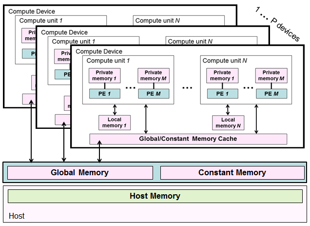

# OpenCL Description

**OpenCL** (Open Computing Language) is framework for general purpose
parallel programming across heterogeneous.
It is designed to harness the compute performance of GPUs, DSPs, FPGAs, etc.
to improve the throughput and latency of computationally intensive workloads.

A well designed OpenCL application running on the appropriate hardware can
significantly outperform an equivalent application running on one or more
CPUs. However, a poorly designed OpenCL application or an OpenCL application
running on inappropriate hardware or inappropriate data can be significantly
slower than an equivalent application running on CPUs. There are several
performance overheads that are inherent to performing computational tasks
off-board modern CPUs which are often overlooked.

Parallel computing latency is governed by [Amdahl's law](https://en.wikipedia.org/wiki/Amdahl%27s_law), i.e. the minimum execution time of a parallelised process can
not be less than the parts of the process that cannot be parallelised.

Where OpenCL is concerned, the parts that cannot be parallelised are:
* OpenCL [Initialisation](#Initialisation)
* and transferring data between the application's **host memory** and OpenCL's **device memory** and vice-versa.

Both OpenCL initialisation and transferring data to and from OpenCL devices
can take significant times especially where there are relatively
large OpenCL programs to be compiled and/or the data must be transferred to a
compute device via a relatively slow mechanism, such as a PCIe bus to a discrete
graphics card. It is not uncommon for OpenCL applications to run *slower* than
an equivalent program running on the application's host!

Often it is not worthwhile developing OpenCL applications for "one off" tasks
or for relatively small data sets, because of the initialisation and data transfer overheads.

Note: the data transfer overhead can be significantly reduced by choosing a CPU
device, since it can use the same memory (and maybe even the same cache) as the
OpenCL application's host.

## OpenCL Application Lifecycle

Figure 1 shows the typical lifecycle of an OpenCL application.
It can be considered as consisting of 4 phases:
* Query
* Initialisation
* Compute
* Clean-up

  
*Figure 1 OpenCL Application Lifecycle*

### Query

In the Query phase the OpenCL application queries the system tha it's running on
to determine what features it supports and which is (are) the best device(s) to
run on.

Where an OpenCL application is designed to run on specific hardware, this simply
involves discovering which OpenCL device(s) correspond to the required hardware.

However, where an OpenCL application is designed to run almost anywhere (like
the tests in this library) then is must query the available platforms and
devices to choose the most appropriate platform and device(s).  

This is not a trivial task since any system with a discrete graphics card is
likely to have more than one platform and each platform is likely to have more
than one device. Furthermore, each device may be accessed by more than one platform,
see Figure 2.

  
*Figure 2 An Example OpenCL System*

The [OpenCL 3.0](https://www.khronos.org/registry/OpenCL/specs/3.0-unified/html/OpenCL_API.html) API specification has new queries to simplify this task.

### Initialisation

After the most suitable platform and device(s) have been chosen it is necessary
to create an OpenCL context for them.

An OpenCL application must have (at least) one context.
An OpenCL context can be created for more than one device, however the devices
must be all be accessed by the same platform. An OpenCL application may create
more than one context, but there will not be any synchronisation between the
contexts.

In order to execute OpenCL kernels on the context device(s), it is necessary to
create (at least) one command queue for each device. OpenCL permits more than
one command queue per device and also enables applications to split devices into
sub-devices, each of which require their own command queue(s).

Also, in order to execute OpenCL kernels, the program(s) in which they are
defined need to be created and built for all the devices in the context
before the kernels themselves can be constructed.

OpenCL programs can be built from source code, Intermediate Language
(IL, e.g [SPIR](https://www.khronos.org/spir/) or [SPIR-V](https://www.khronos.org/registry/spir-v/)) or binaries. Building from source or IL can take minutes for complex kernels, therefore it is tempting to load binary programs especially if the application is designed to run on specific hardware.

Note: some devices have built-in kernels, e.g. [Intel Motion Estimation](https://software.intel.com/content/www/us/en/develop/articles/intro-to-advanced-motion-estimation-extension-for-opencl.html). These can also be
built into the context for the device(s) that have them.

Finally, the OpenCL kernels require memory from which to read input data and
write output data. Unless using host Shared Virtual Memory (SVM), the OpenCL
device memory (buffers, images and svm) must be created before data can be
transferred to and from the host to the OpenCL device global memory, see Figure 3.

  
*Figure 3 The OpenCL Memory Model*

### Compute

### Clean-up